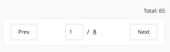
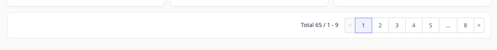
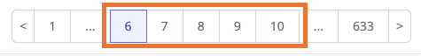

<div align="center">
  
  <h1>react-paginator</h1>
  <p>Simple and easy-to-use pagination library for React</p>

[](https://www.npmjs.com/package/@careerday-jobs/react-paginator)
[](https://www.npmjs.com/package/@careerday-jobs/react-paginator)
[](https://careerday.jobs)
</div>

## 📚 Why react-paginator?

Every web developer should work on pagination at some point. We were using React.js,
and surprised by the fact that there is no single package we'd like to just install and start using.
If you're using React and going to work on pagination, then *react-paginator* is a worth trying.

## 🖥 Screenshots

#### Mobile



#### Desktop



## 📦 Installation

```bash
npm install @careerday-jobs/react-paginator
```

## 🪄 Basic Usage

```tsx
// import at the top of file
import { PaginatedParam, usePaginated, PaginatedCommander } from '@careerday-jobs/node-paginator';

// In a React component.
const SampleComponent = () => {

  // 1. Call usePaginated(). Give page size and selectablePageNumberRange.
  const [paginated, setPaginated, drawPaginated, selectablePageNums] = usePaginated(10, 5);

  // 2. Return <PaginatedCommander /> component
  return (
    <>
      <PaginatedCommander
        paginated={paginated}
        setPaginated={setPaginated}
        selectablePageNums={selectablePageNums}
        dataFetchFunction={async (page: number) => {
          const apiResponse = await axios.get('https://myawesomehomepage.com/showitems?page=' + page);
          const totalItemCount = parseInt(apiResponse.data.totalItemCount);

          // 3. Call drawPaginated() everytime page changes.
          const paginatedParam = new PaginatedParam(
            1, // pageNo 
            10, // pageSize
            totalItemCount, // totalItemCount
            5 // selectablePageNumberRange
          );
          
          drawPaginated(paginatedParam);
        }}
      />
    </>
  );
}

```

## 🪄 Parameters

### usePaginated()

* **pageSize** ```number```

      The size of each page.

* **selectablePageNumberRange** ```number```

      The range of page numbers you can see. 
      For example, if selectablePageNumberRange is 5, 
      you will see page numbers like 1, 2, 3, 4, 5 when you're on the 1st page.
      And you will see 6, 7, 8, 9, 10 when you're on the 7th page.
 
<div align="center">
    
</div>

### PaginatedParam

PaginatedParam constructor requires four parameters like below.

* **pageNo** ```number```

      Current page number.

* **pageSize** ```number```

      The size of each page.

* **totalItemCount** ```number```

      The number of whole items.

* **selectablePageNumberRange** ```number```

      The range of page numbers you can see. 
      For example, if selectablePageNumberRange is 5, 
      you will see page numbers like 1, 2, 3, 4, 5 when you're on the 1st page.
      And you will see 6, 7, 8, 9, 10 when you're on the 7th page.
 
## ⏳ Pagination Library On Backend

Looking for a library which supports pagination on backend? 

[Node-paginator](https://github.com/careerday-jobs/node-paginator) is worthing trying!

## 👨👩 Contributors

<a href="https://github.com/kunhokimcareerday">
@kunhokimcareerday </a>

<a href="https://github.com/starseeder0309">
@starseeder0309 </a>

<a href="https://github.com/hyojin961">
@hyojin961 </a>

[//]: contributor-faces

## 🔑 License

[MIT](https://github.com/careerday-jobs/react-paginator/LICENSE) @ 2022 CareerDay
